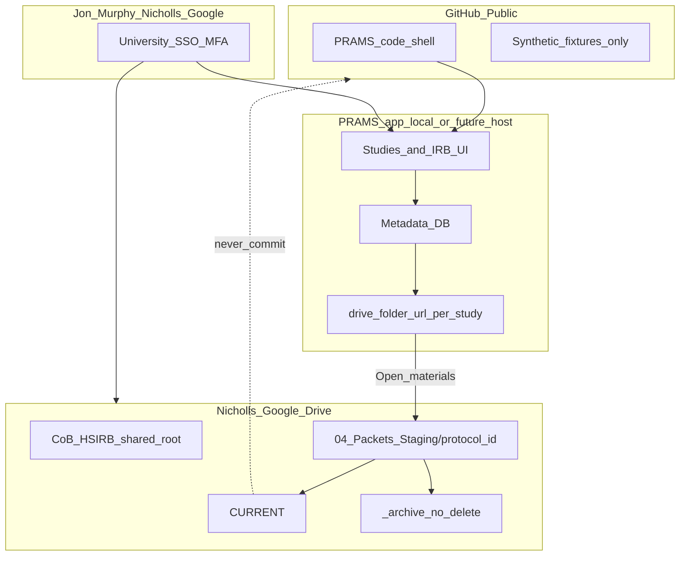

# Plan: PRAMS on GitHub + Nicholls Google Drive for study materials

**Status:** Phase 1 partial — Drive URL locked in docs; `Study.drive_folder_url` / `drive_folder_id` + researcher/IRB “Open materials in Google Drive” link; local Castille studies pointed at shared root.  
**Primary user (CoB IRB):** Jon Murphy (College of Business HSIRB representative)  
**Data Owner:** CoB IRB representatives (shared Drive access)

## Does this make sense?

**Yes.** It matches Nicholls IT constraints and the CoB path already sketched:

| Layer | Where | Who / how |
|--------|--------|-----------|
| Product code (no Confidential data) | GitHub public/shell | Developers; synthetic fixtures only |
| Study / protocol **materials** (packets, CITI, consents, flyers) | Nicholls Google Drive | Authorized via university Google accounts |
| Metadata in the app (titles, dates, renewal, Drive folder link) | App DB (local or future host) — **no file blobs of packets in git** | Jon Murphy + CoB reps / PIs as roles allow |

IT will not own or “secure” a faculty-built SaaS. Using **university Drive** for Confidential files puts storage on a campus-authorized system; the app becomes a **workflow UI + pointers**, not a second file vault on GitHub.

This does **not** require IT to approve “AI software.” Frame it as: faculty research-admin tooling + Data Owner Drive practices.

## What exists today

- **GitHub shell model** already documented in root README (code only; institutional data elsewhere).
- **Full PRAMS** (`config.settings`) stores many materials as Django `FileField` under local `MEDIA` (protocol PDFs, CITI, flyers, amendments) — fine for local demo, **wrong** as the long-term Confidential store if the goal is Nicholls Drive.
- **CoB IRB consensus pack** ([`docs/cob-irb-consensus/`](docs/cob-irb-consensus/)) already defines Drive folder schema, no-delete retention, and protocol registry JSON on Drive — reuse that layout for per-study materials.
- **Jon Murphy** is already modeled as CBA college representative in protocol assignment / test docs (college-rep workflow).

## Target architecture



### Hard split (non-negotiable)

1. **Never** commit study packets, CITI certificates, real consent PDFs, or live registries to GitHub.
2. **Never** permanently delete Drive files — supersede into `_archive/` with `CHANGE_NOTE` / `UPDATE_LOG` ([NO_DELETE_RETENTION.md](NO_DELETE_RETENTION.md)).
3. **No** service-account “app owns the Drive” without an explicit IT-approved path. Prefer **user’s Nicholls Google identity**.

## Jon Murphy access story (“when he uses the tool…”)

Intended UX (Phase 1 — recommended first):

1. Jon opens PRAMS (local now; later whatever host CoB accepts — not framed as IT-secured SaaS).
2. He logs into PRAMS with his **local / CoB role account** (college rep).
3. For each study/protocol he is assigned, the UI shows **Open materials in Google Drive** (deep link to that study’s folder).
4. Google prompts Nicholls login / MFA if needed. Drive permissions (Editor on CoB HSIRB root) gate what he can see — not a secret API key in the repo.
5. Uploads / updates happen **in Drive** (or later via Picker). PRAMS records only: protocol id, short title, approval/renewal dates, `drive_folder_url`, status.

“Triggers” in Phase 1 means: **navigation + permission check via Google SSO**, not a silent background sync of all files into the app.

### Phase 2 (optional, later)

- Nicholls Google OAuth (user-delegated) + Google Picker to attach/upload into the correct `CURRENT/` folder from the PRAMS UI.
- Still no files in GitHub; refresh tokens stored only in local/secure env, never committed.
- Still no domain-wide service account unless IT explicitly approves.

## Drive layout (reuse CoB pack)

Root (shared Drive URL locked): https://drive.google.com/drive/folders/1jGaOtprui6PUq7r5W6qR6QYC9sRRXQpG (folder id `1jGaOtprui6PUq7r5W6qR6QYC9sRRXQpG`):

```
CoB-HSIRB/
  03_Protocol_Registry/     ← registry JSON for renewals
  04_Packets_Staging/
    {protocol_id}/
      UPDATE_LOG.md
      CURRENT/              ← materials Jon/PI use
      _archive/…            ← no-delete history
```

Each PRAMS study/protocol row stores `drive_folder_url` (and optional `drive_folder_id`) pointing at `{protocol_id}/`.

## GitHub deliverables (code-only)

1. Keep / push **shell** code to the public GitHub repo (scrub MEDIA, sqlite with real packets, `.env`, invite emails with credentials).
2. Add models/fields: `drive_folder_url`, `drive_folder_id`, maybe `materials_location = drive|local_media` for transition.
3. College-rep UI: study list → “Materials (Drive)” button; empty-state instructions if folder not linked yet.
4. Admin/management command: create Drive folder URL placeholders from protocol ids (human creates folders in Drive once; command only writes links — Phase 1 does not call Google APIs).
5. Document Data Owner, Jon Murphy role, and no-delete rules next to CoB consensus pack.
6. `.gitignore` / scrub checklist so Confidential never lands on GitHub.

## Sequencing

| Step | Action | Owner |
|------|--------|--------|
| 1 | Shared Drive URL locked in docs; confirm Jon Murphy (+ other CoB reps) as Editors | CoB IRB / user — **URL locked**; **Jon Murphy + Chris Castille Editor confirmed (2026-08-11)** |
| 2 | Create folder tree from DRIVE_FOLDER_SCHEMA; migrate existing packets into per-protocol `CURRENT/` + UPDATE_LOG | CoB IRB + PI as needed — root has Approvals / Submitted Documentation / CITI_Certificates; numbered schema still optional |
| 3 | Scrub repo; ensure GitHub has code + synthetic only | Dev |
| 4 | Add Drive link fields + Murphy-facing “Open materials” in PRAMS | Dev — **done locally** (`drive_folder_url`, researcher + IRB dashboards) |
| 5 | Point each of the ~local studies at its Drive folder; verify Jon can open via Nicholls Google | CoB IRB + Dev — **Castille’s 5 local studies pointed at shared root**; Jon verify still open |
| 6 | (Optional) OAuth + Picker Phase 2 | Dev after Step 5 works |

## Out of scope / avoid

- Rebuilding Bayou PAL IT hosting or asking IT to “approve AI software.”
- Putting packet binaries or live registry on GitHub.
- Service-account Drive sync that looks like unsanctioned campus SaaS.
- Auto-deleting files or registry rows.
- In-house signup/credit SaaS (already parked).

## Success criteria

- Jon Murphy can log into PRAMS, see CoB-assigned studies, and open each study’s materials in Nicholls Drive without materials living in git.
- GitHub clone has no Confidential study files.
- Updates follow no-delete archive rules so IRB can always find prior versions.
- Qualtrics / recruitment stay PI-owned; Drive holds IRB packet materials.

## Open items (fill as you go)

- [x] Shared Drive URL: https://drive.google.com/drive/folders/1jGaOtprui6PUq7r5W6qR6QYC9sRRXQpG (folder id `1jGaOtprui6PUq7r5W6qR6QYC9sRRXQpG`)
- [x] Confirm Jon’s Nicholls Google account has Editor on the root (**confirmed 2026-08-11**; Castille also Editor)
- [ ] Whether PIs get Viewer on their own `{protocol_id}` only
- [ ] Whether Phase 2 OAuth is desired in year 1 or links-only is enough
